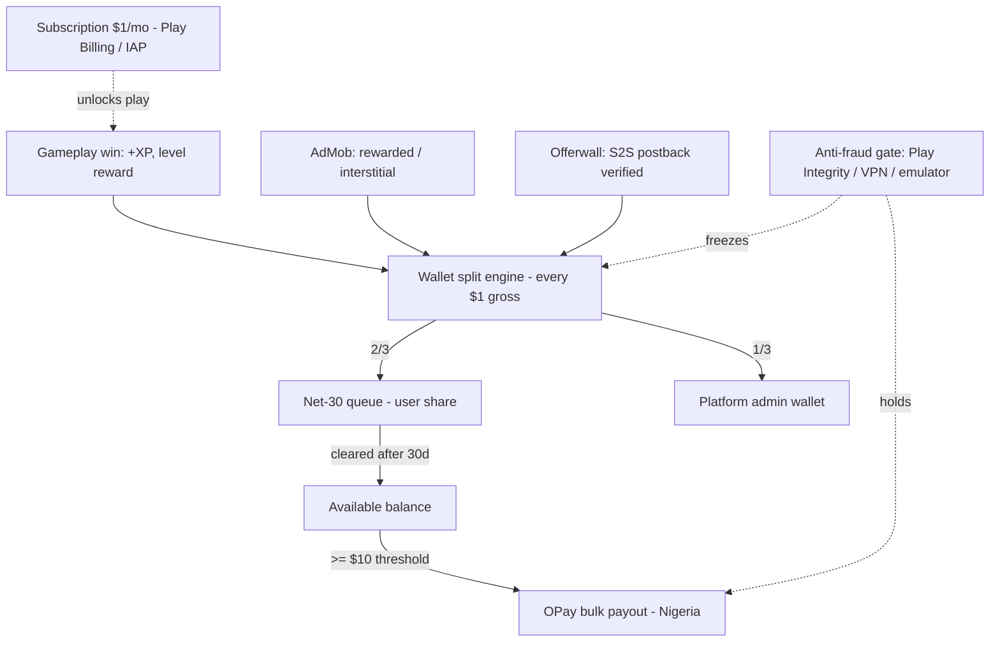

# ShapeCash - Level-to-Earn Memory Match (Flutter + Riverpod)

A cross-platform **Level-to-Earn** casual game POC: a clean geometric **Memory Match** game wrapped in a real reward economy - virtual wallet with a **2/3 user / 1/3 platform** revenue split, a **Net-30 payout queue**, a **$10 minimum cash-out threshold**, **OPay** disbursement for Nigeria, and a **Play Integrity / DeviceCheck** anti-fraud gate. Everything runs on mock data on a bare simulator (no ad SDK, billing, or backend keys needed).

## Screenshots

| Home (subscription gateway) | Memory Match (energy + rewarded hint) | Board cleared (level reward) |
|---|---|---|
|  |  |  |

| Wallet (2/3-1/3 split, Net-30) | OPay cash-out (>= $10) | Earn (AdMob + offerwall S2S) |
|---|---|---|
|  |  |  |

| Device trusted | Device blocked (fraud) |
|---|---|
|  |  |


## What it shows

- **Core casual gameplay** - a high-performance Memory Match game built from flat-vector geometric shapes (circle, square, triangle, star, hexagon, diamond) drawn with `CustomPainter` (zero image assets). An **Energy** mechanic gates rounds and a rewarded-video **Hint** power-up briefly reveals a matching pair.
- **Monetization stack** - a $1/month **subscription gateway** (Google Play Billing / Apple IAP), **AdMob** rewarded + interstitial placements, and an **offerwall** (BitLabs / Adjoe / Torox). Offer rewards only credit after a simulated **Server-to-Server (S2S) postback** confirms them - a tapped "Complete" never pays alone.
- **Wallet & ledger** - incoming gross revenue is split on arrival **2/3 to the user, 1/3 to the platform admin**. The user share enters a **Net-30 queue** and matures into the available balance after a 30-day clearance window.
- **Payout automation** - once the available balance clears the **$10 threshold**, a bulk disbursement is queued through the **OPay Business/Payout API** (mocked) with a generated reference.
- **Anti-fraud suite** - a device-trust panel modelling **Play Integrity API / Apple DeviceCheck**, emulator detection, **VPN/proxy** blocking, multi-account farming, and click-bot heuristics. A "Simulate fraud" toggle shows earning and payout freezing when attestation fails.

## Revenue & payout flow




## Architecture

Feature-first Flutter with **Riverpod** `Notifier` providers, one per bounded concern - state is decoupled from UI and the cross-feature economy flows through a single wallet provider.

```
lib/
  main.dart                       ProviderScope root
  src/
    app.dart  shell.dart  theme.dart
    state/
      account_state.dart          XP / level / energy / subscription
      game_state.dart             Memory Match board, matching, hint, win reward
      wallet_state.dart           2/3-1/3 split, Net-30 queue, $10 threshold, OPay payout
      earn_state.dart             AdMob + offerwall S2S postback verification
      integrity_state.dart        Play Integrity / DeviceCheck anti-fraud signals
    screens/                      home / game / wallet / earn / integrity
    widgets/                      ShapePainter (flat-vector shapes), shared UI
```

- **Single source of economic truth**: gameplay, ads, and offers all call `walletProvider.creditRevenue(source, gross)`, which applies the 2/3-1/3 split and Net-30 timing in one place.
- **Untrusted client**: offer completion is provisional until the simulated S2S postback verifies it; fraud attestation gates the whole earn-to-payout path.
- **Deterministic board**: the shuffle is seeded so the demo is reproducible.

## Run

```bash
flutter pub get
flutter run        # iOS Simulator or Android emulator - no keys or backend
```

Stack: Flutter 3.41 / Dart 3.11, `flutter_riverpod`. Mobile only (iOS + Android).
