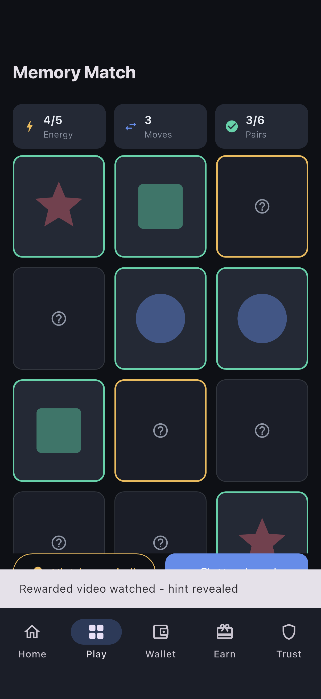
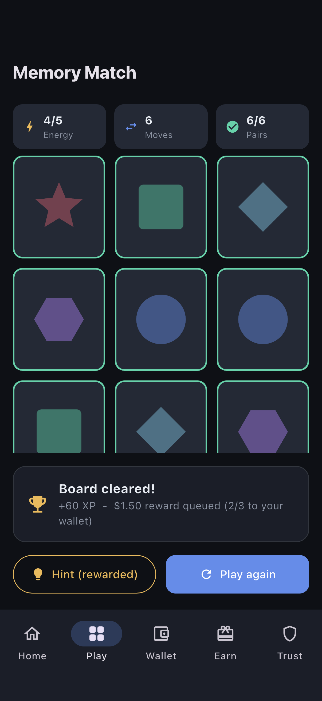
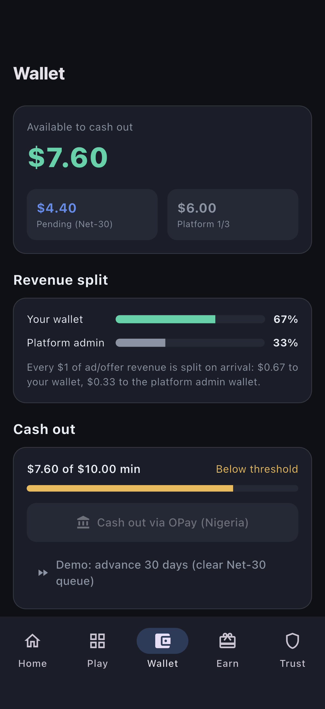
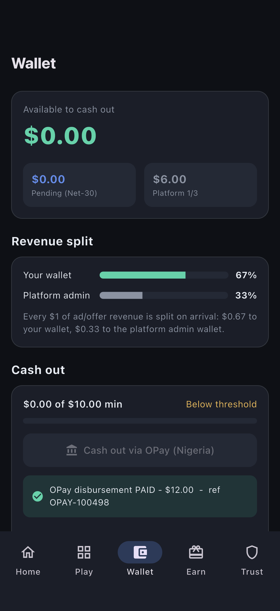
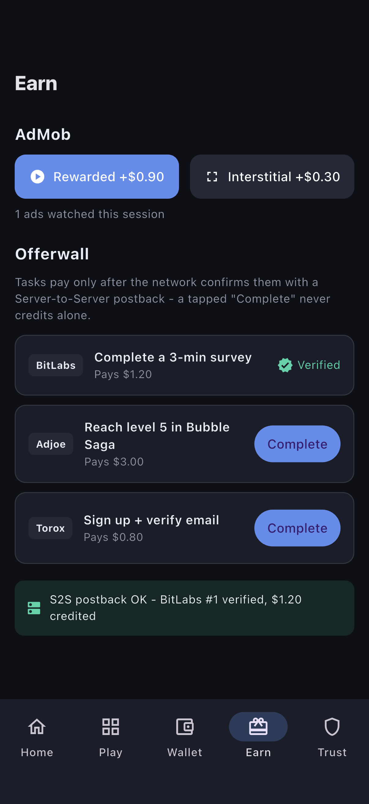
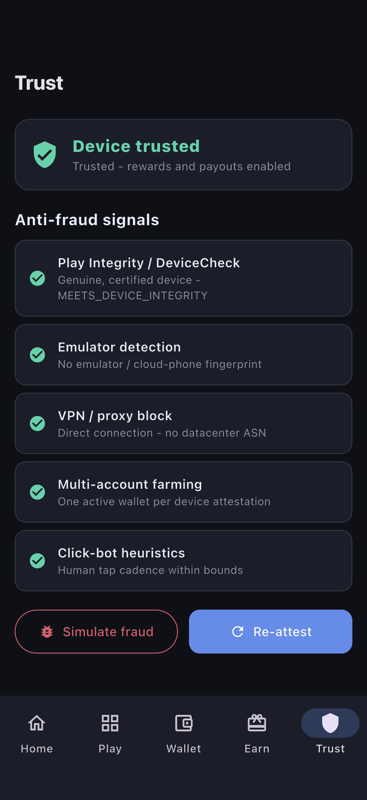
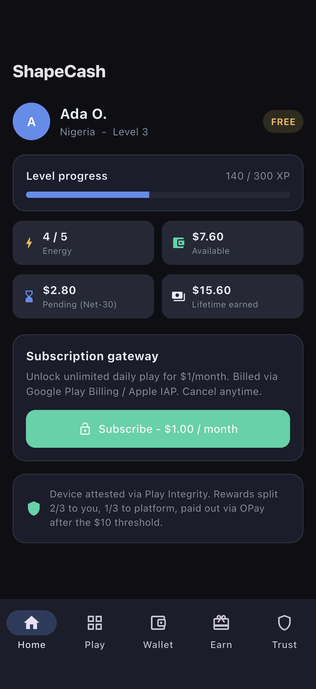
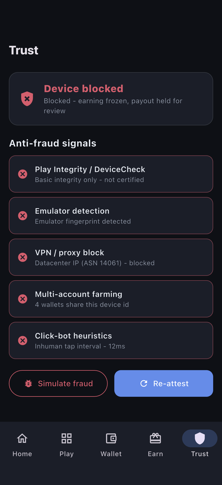
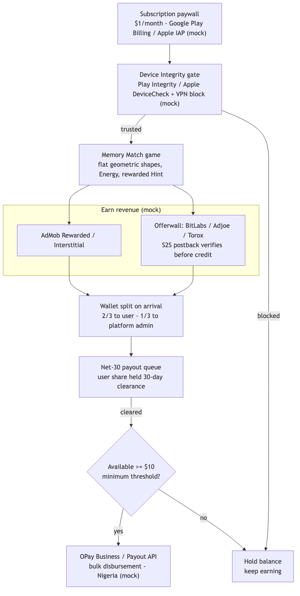

# Level-to-Earn - Memory Match Shape Game with Reward Wallet

A Flutter + Riverpod proof of concept for a "Level-to-Earn" casual game. Players
pay a $1/month subscription to play a clean, flat-vector memory match game
(Circles, Squares, Stars and more), then earn cash by watching rewarded ads and
completing offerwall tasks. Incoming revenue is split 2/3 to the user and 1/3 to
the platform admin, held in a Net-30 payout queue, and disbursed to users in
Nigeria via OPay once a $10 minimum threshold is met. Anti-fraud is modelled with
Play Integrity / Apple DeviceCheck signals and a VPN/proxy block. Everything runs
on a simulator with mock data - ads, IAP, offerwall S2S postbacks, integrity
checks and OPay payouts are all simulated behind taps.

## Screens

| Memory Match | Win + Level Reward | Wallet (2/3 - 1/3 split) |
| --- | --- | --- |
|  |  |  |

| OPay Payout (Net-30) | Earn / Offerwall | Device Integrity |
| --- | --- | --- |
|  |  |  |

| Home / Subscription paywall | Fraud blocked |
| --- | --- |
|  |  |

### Demo


### Data & screen flow



## What it shows

- **Core gameplay**: a high-performance memory match grid of flat geometric
  shapes drawn with a pure `CustomPainter` (no image assets). An "Energy"
  mechanic gates rounds, and a rewarded-video "Hint" power-up briefly highlights
  a matching pair after a mock rewarded ad.
- **Monetization**: a mock $1/month recurring subscription (Google Play Billing /
  Apple IAP) gating play, plus AdMob Rewarded and Interstitial ads, and an
  offerwall listing BitLabs / Adjoe / Torox tasks. Offerwall tasks only credit
  after a simulated Server-to-Server (S2S) postback confirms them - a tapped
  "Complete" never pays on its own.
- **Wallet architecture**: a virtual wallet ledger that splits every unit of
  ad/task revenue 2/3 to the user and 1/3 to the platform admin on arrival, with
  a $10 minimum payout threshold and a Net-30 queue that holds the user's share
  for a 30-day clearance cycle before it becomes cashable.
- **Payout automation**: an OPay Business/Payout API bulk-disbursement screen
  (Nigeria) that is gated behind the threshold and produces a payout reference.
- **Anti-fraud**: a Device Integrity panel modelling Play Integrity / Apple
  DeviceCheck verdicts, emulator/multi-account detection, click-bot heuristics
  and a server-side VPN/proxy block, with a "simulate fraud" toggle that freezes
  earning and holds payouts.

## Architecture

- **Flutter + Riverpod** with a feature-per-file `lib/src` layout.
- State is held in five `Notifier`s, each exposed via a `NotifierProvider`:
  - `accountProvider` - profile, XP/level, Energy, subscription status.
  - `gameProvider` - deterministic (seeded) memory-match board, hint logic.
  - `walletProvider` - ledger, 2/3-1/3 split, Net-30 clearance, OPay payout.
  - `earnProvider` - AdMob mocks + offerwall tasks with delayed S2S postbacks.
  - `integrityProvider` - device-trust signals and the fraud toggle.
- Earning flows write into the wallet ledger through `walletProvider`, which is
  the single source of truth for balances, the revenue split and payout gating.
- All external systems (ads, IAP, offerwall networks, OPay, Play Integrity) are
  mock layers, so the whole app is fully demoable on a simulator with no real
  SDKs, backend or hardware.

## Run

```bash
flutter pub get
flutter run
```
